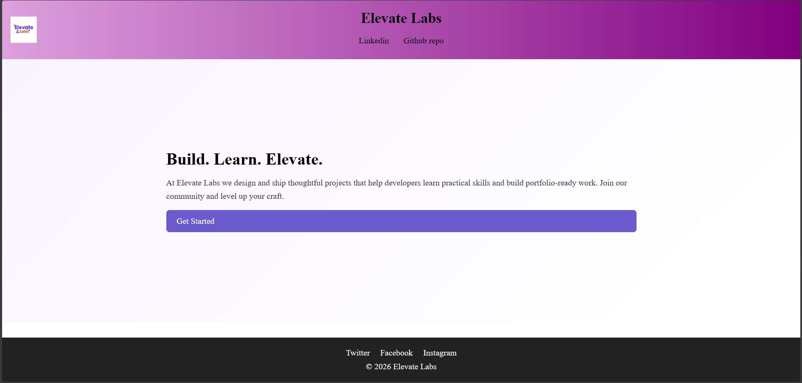

# Elevate Labs — Simple Responsive Landing Page

A small demo project that shows a clean, responsive landing page built with HTML and CSS.

## Features
- Header with logo and navigation
- Hero section with heading, paragraph, and call-to-action button
- Responsive layout using Flexbox and Grid
- Media queries for small screens
- Footer with social links

## Files
- `index.html` — main page
- `style.css` — styles
- `logo.png` — project logo (replace with your image)

## Run locally
1. Open `index.html` directly in your browser, or
2. Serve with a simple HTTP server (recommended for live-server features):

Then open http://localhost:5500 in your browser and resize the window to test responsiveness.

## Customize
- Replace `logo.png` with your own logo
- Edit text and colors in `index.html` and `style.css`

Enjoy!

## Result1
### Image: Result1

